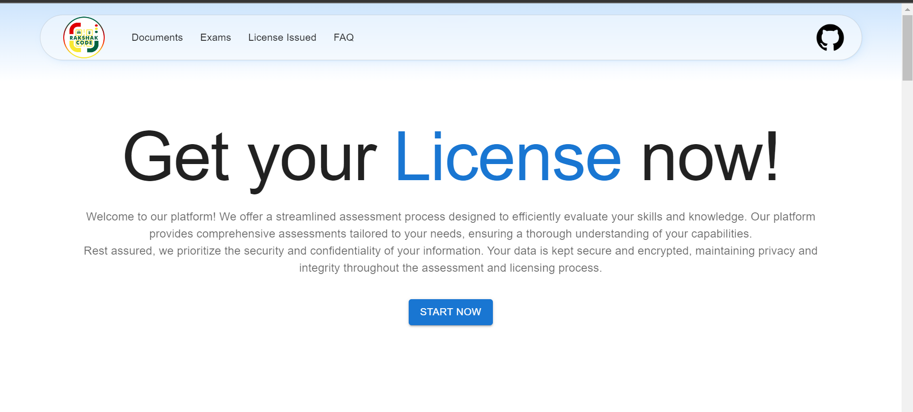
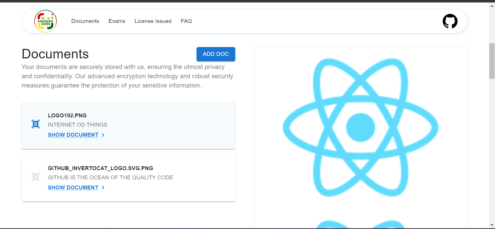

# Project Name

Description of the project.

## Table of Contents

1. [Introduction](#introduction)
2. [Installation](#installation)
3. [API Endpoints](#api-endpoints)
4. [Screenshots](#screenshots)


## Introduction

Brief introduction to the project, its purpose, and what it aims to achieve.


## Installation

1. Clone the repository:   git clone https://github.com/dhairyarajbabbar/rakshak

2. Navigate to the backend directory:  cd digitalWorkIndia

3. Install dependencies: npm install

4. create a  .env file in both directories with
        MONGO_DB_PASSWORD= your_password
        MONGO_DB_URL=   your mongodb database url
        FRONTEND= http://localhost:3000
        RSA_PRIVATE_KEY= "OKAY_IT_DOESNT_MATTER_WHATS_IN_HERE"
        EXPIRES_IN=1000000000
        NODE_ENV=development

5. run npm start: The server will be running on localhost:4000 in your browser.

6. Open another terminal window and navigate to the "frontend_d_w_i" folder: cd frontend_d_w_i

7. Install dependencies: npm install

8. run npm start: The react app will be running on localhost:3000 in your browser.

9. create a  .env file in both directories with  REACT_APP_BASEURL=http://localhost:4000/


## API Endpoints

### Authentication

- `POST /api/auth/signup`
  - Description: Register a new user.
  - Request Body:
    ```json
    {
      "email": "user@example.com",
      "password": "password123"
    }
    ```

- `POST /api/auth/login`
  - Description: Log in an existing user.
  - Request Body:
    ```json
    {
      "email": "user@example.com",
      "password": "password123"
    }
    ```

- `GET /api/auth/logout`
  - Description: Log out the current user.

### Documents

- `POST /api/documents/add`
  - Description: Upload a document.
  - Request Body: (Form data with 'image' field containing the document file)
  - Response: (Document object)

- `GET /api/documents/:documentId`
  - Description: Get a specific document by ID.
  - Response: (Document object)

- `DELETE /api/documents/:documentId`
  - Description: Delete a document by ID.

- `GET /api/documents/`
  - Description: Get all documents belonging to the user.
  - Response: (Array of document objects)

### Exams

- `POST /api/exam/start`
  - Description: Start a new exam session.
  - Request Body: (Exam session details)
  - Response: (Session ID)

- `POST /api/exam/submit`
  - Description: Submit answers for an exam session.
  - Request Body: (Answers data)
  - Response: (Result)

- `GET /api/exam/results`
  - Description: Get exam results.
  - Response: (Array of exam result objects)

- `GET /api/exam/user-sessions`
  - Description: Get exam sessions for the current user.
  - Response: (Array of exam session objects)

### Profile

- `GET /api/profile`
  - Description: Get user profile information.
  - Response: (User profile object)

- `GET /api/profile/picture`
  - Description: Get user profile picture.
  - Response: (Binary image data)

- `PUT /api/profile/update`
  - Description: Update user profile information.
  - Request Body: (Updated profile data)
  - Response: (Updated profile object)

- `POST /api/profile/upload-picture`
  - Description: Upload or update user profile picture.
  - Request Body: (Form data with 'image' field containing the profile picture file)
  - Response: (Uploaded profile picture URL)

## Screenshots





